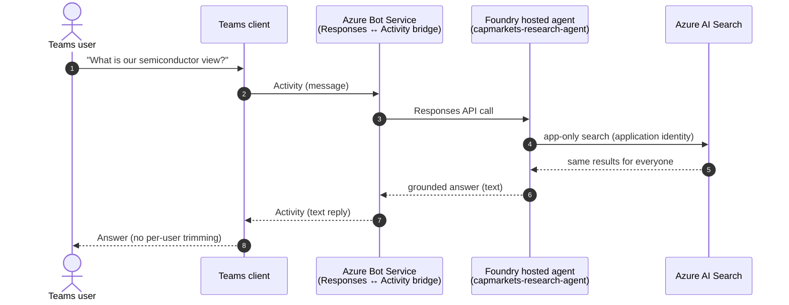
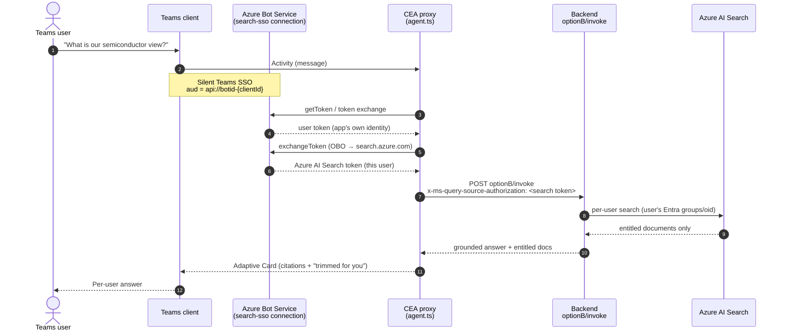
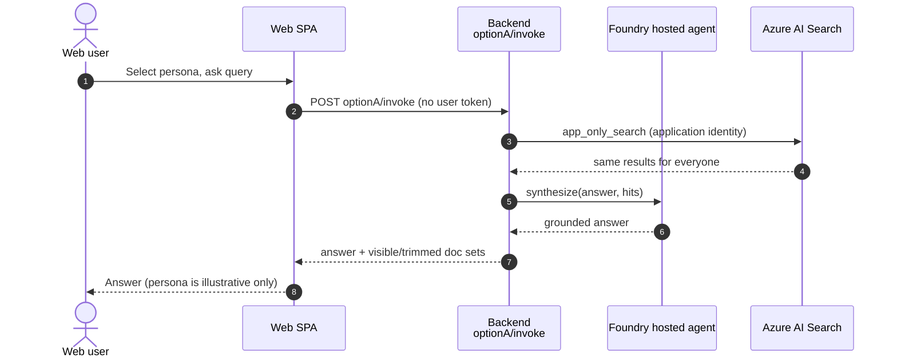
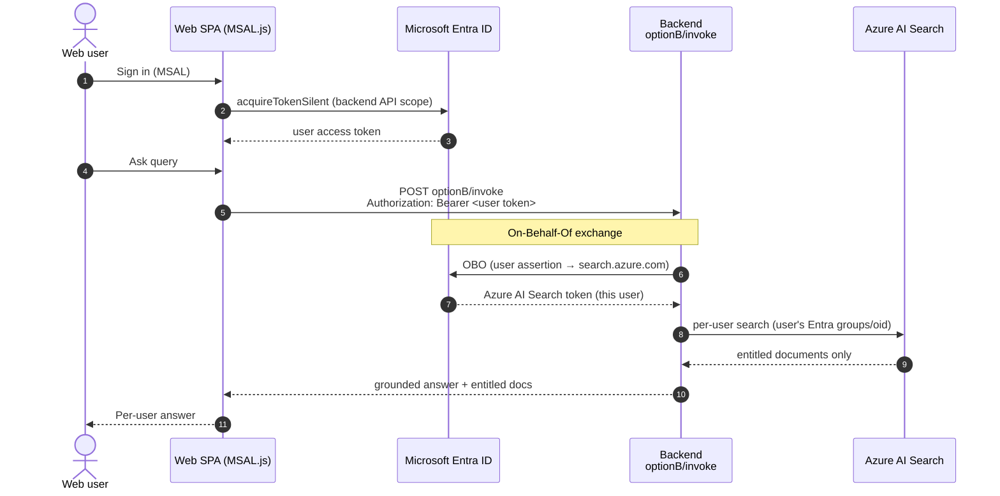
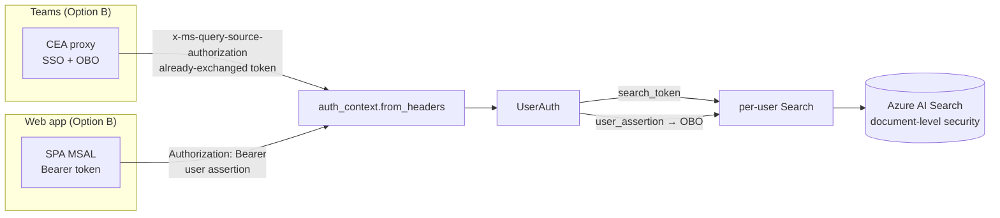

# End-to-end flows — Teams and Web app, Option A vs Option B

This document shows how a research query travels end-to-end across the two front doors
(**Microsoft Teams** and the **custom web app**) under the two entitlement models
(**Option A** app-only and **Option B** per-user On-Behalf-Of).

The design goal: **one deployed agent, two front doors**. Whether a request arrives from
Teams or the web app, it resolves to the same downstream Azure AI Search call — the only
difference is *whose* identity drives document trimming.

## The two options in one sentence

- **Option A — app-only.** The agent searches with a single application/admin identity.
  Every user sees the same result set. No per-user document trimming.
- **Option B — per-user (OBO).** The signed-in user's identity is exchanged
  On-Behalf-Of for an Azure AI Search token, so results are trimmed to that user's
  entitlements (document-level security).

## Matrix

| Surface | Option A (app-only) | Option B (per-user OBO) |
|---|---|---|
| **Teams** | Foundry hosted agent published directly via Azure Bot Service; in-container app-only Search | Custom Engine Agent proxy runs Teams SSO + OBO, calls backend with the user's Search token |
| **Web app** | SPA calls `optionA/invoke`; backend app-only Search | SPA (MSAL) sends user token; backend runs OBO, per-user Search |

## Components referenced

| Component | Path / resource |
|---|---|
| Teams proxy (Custom Engine Agent) | [proxy/src/agent.ts](../proxy/src/agent.ts) |
| Azure Bot + OAuth connection | `capmarkets-obo-bot` / `search-sso` |
| Backend invocation orchestration | [backend/app/services/invoke_service.py](../backend/app/services/invoke_service.py) |
| Per-request user identity | [backend/app/services/auth_context.py](../backend/app/services/auth_context.py) |
| OBO exchange (web path) | [backend/app/services/obo_service.py](../backend/app/services/obo_service.py) |
| Search (app-only + per-user) | [backend/app/services/search_service.py](../backend/app/services/search_service.py) |
| Answer synthesis (hosted agent) | [backend/app/services/foundry_service.py](../backend/app/services/foundry_service.py) |
| Web SPA + MSAL | [frontend/src/auth/msalConfig.ts](../frontend/src/auth/msalConfig.ts), [frontend/src/api/client.ts](../frontend/src/api/client.ts) |

Both front doors converge on `auth_context.from_headers(...)`, which produces a single
`UserAuth`:

- Web app (Option B) sends `Authorization: Bearer <user token>` → backend performs OBO.
- Teams (Option B) sends `x-ms-query-source-authorization: <already-exchanged Search token>`
  → backend uses it directly.

## 1. Teams client — Option A (app-only)

The Foundry hosted agent is published directly to Teams through Azure Bot Service. Teams
speaks the Activity protocol; Bot Service bridges Responses ↔ Activity automatically. The
agent's in-container Search runs with the **application** identity, so there is no per-user
trimming.



Notes:

- Identity basis: **application/admin** — every user gets the same documents.
- The Responses → Activity bridge preserves text; it does **not** carry citations,
  streaming, or Adaptive Cards.

## 2. Teams client — Option B (per-user OBO)

Teams routes to the **Custom Engine Agent proxy**, which is the OBO trust boundary. The
proxy runs Teams SSO silently, exchanges the SSO token On-Behalf-Of for an Azure AI Search
token, and forwards it to the backend so Search trims per user.



Notes:

- Identity basis: **the signed-in Teams user** — results reflect that user's entitlements.
- The proxy sends the **already-exchanged** Search token; the backend does no OBO on this
  path (it reads `x-ms-query-source-authorization`).
- If SSO/OBO is not yet complete, the proxy omits the token and the backend fails **closed**
  to public-only documents with a "sign in" hint.

#### Who does the OBO, step by step

On the Teams path the **proxy is the trust boundary and does all the token work** — the
backend only forwards what it receives. The mechanics in [proxy/src/agent.ts](../proxy/src/agent.ts):

1. **SSO.** The `search` authorization handler silently signs the Teams user in (audience
   `api://botid-{clientId}` — the app's own identity), producing the base token.
2. **OBO in the proxy.** `agentApp.authorization.exchangeToken(context, [searchScope], "search")`
   exchanges that SSO token On-Behalf-Of for an **Azure AI Search-scoped token** that
   represents the signed-in user. The returned `tokenResponse.token` is the `searchToken`.
3. **Pass to backend.** The proxy `POST`s `optionB/invoke` with header
   `x-ms-query-source-authorization: <searchToken>`.
4. **Backend uses it directly.**
   [auth_context.from_headers](../backend/app/services/auth_context.py) reads that header into
   `UserAuth.search_token`, and `per_user_search` hands it straight to Azure AI Search as
   `x_ms_query_source_authorization`. **The backend performs no OBO on this path** — the token
   is already exchanged.

Audience / scope progression:

```text
Teams user session
  → (SSO)             token aud = api://botid-{clientId}     [app's own identity]
  → (OBO in proxy)    token aud = https://search.azure.com   [the user's Search token]
  → backend → Azure AI Search  (native ACL trims to this user's entitlements)
```

#### Teams vs. web app — where the OBO happens

This is the one contrast worth memorizing:

| Path | Who performs the OBO | What the backend receives | Header used |
|---|---|---|---|
| **Teams (Option B)** | The **proxy** (`exchangeToken`) | An **already-exchanged** Search token | `x-ms-query-source-authorization` |
| **Web app (Option B)** | The **backend** (`obo_service`) | The user's **own** token (needs OBO) | `Authorization: Bearer` |

Both converge on the identical `per_user_search` call — that is the "one agent, two front
doors" design. The browser never holds OBO credentials; on the web path only the backend does,
and on the Teams path only the proxy does.

## 3. Web app — Option A (app-only)

The SPA calls the app-only endpoint. The backend runs Search with the application/admin
identity and the hosted agent synthesizes the answer. No user token is required.



Notes:

- Identity basis: **application/admin**. The persona selector is illustrative; it does not
  change entitlements on this path.
- With `option_a_admin_identity` enabled, the answer is grounded on what the admin identity
  retrieved (so it reflects the full-access view rather than "no entitled research").

## 4. Web app — Option B (per-user OBO)

The SPA signs the user in with MSAL and sends the user token (issued for the backend's API
scope) as a Bearer header. The backend performs the On-Behalf-Of exchange itself, then runs
per-user Search.



Notes:

- Identity basis: **the signed-in web user** — same trimming semantics as Teams Option B.
- The backend, not the browser, holds the OBO credentials; the SPA only ever sends its own
  user token.
- `auth_context.from_headers(...)` puts the Bearer token into `user_assertion`, which
  triggers the OBO exchange in `obo_service`.

## Where the two front doors converge



Both Option B paths resolve to the identical per-user Search call, which is why a single
deployed agent serves both surfaces with correct per-user document trimming. Option A on
either surface skips identity entirely and uses the application identity.

## Nuances and gotchas (read before demoing Option A)

These are subtle behaviors that surprised us in testing. They are expected, but non-obvious.

### The Teams-published hosted agent (Option A) returns *zero* documents — including public

When you chat with the **Foundry hosted agent published directly to Teams** (flow 1), you may
see a response like *"I looked in our app-only research but did not find any entitled
documents on this topic."* — with **no documents at all**, not even the public one. This is
**correct and expected** for that path. Two independent reasons combine:

1. **The "Foundry login" prompt is not an OBO.** When the hosted agent asks you to sign in to
   Foundry, that authenticates you to the **Foundry agent runtime** so it may run the agent.
   It does **not** exchange your token On-Behalf-Of for a Search token. On Option A the Teams
   user identity never reaches the tool call — the in-container Search tool queries with the
   **container's managed identity**, not your (admin) identity. Signing in as admin therefore
   changes nothing about what the tool can retrieve.

2. **The index has native ACL enabled** (`permissionFilterOption=enabled`). Native ACL trims
   results by evaluating the **caller's real Entra groups/oid from a user token**. A query
   that arrives with no qualifying user identity (the managed identity is not a member of any
   document's ACL) matches **zero documents**. Native ACL has no token-less "public" concept,
   so even the public doc (`DISC-000`) is filtered out.

Chain: no OBO on Option A → Search runs as the container identity → native ACL finds no
matching membership → 0 docs → *"no entitled research."*

This is actually the intended lesson of Option A: because the user's identity can't flow to
the tool, a document-security-enabled index returns nothing per user. That gap is exactly what
Option B (proxy SSO + OBO) closes.

### The web app's Option A behaves differently — it *does* return documents

The web app's `app_only_search` in
[backend/app/services/search_service.py](../backend/app/services/search_service.py) does **not**
go token-less into native ACL. It either:

- presents the backend's **admin managed-identity token** (`option_a_admin_identity` → full
  entitlements, no filter), or
- applies a plain **`classification ne 'mnpi'` filter** (undifferentiated non-MNPI slice).

So the web-app Option A returns a baseline set, while the **Teams-published** Option A returns
0. Same "Option A" label, two different retrieval implementations — do not expect them to match.

| Option A surface | Retrieval mechanism | Typical result |
|---|---|---|
| Teams (published hosted agent) | Container managed identity → **native ACL** | 0 docs ("no entitled research") |
| Web app (`optionA/invoke`) | Admin token **or** `classification ne 'mnpi'` filter | Baseline / non-MNPI docs |

### How to make Teams Option A show a public baseline (if desired)

If you want the Teams-published Option A demo to surface a shared public set instead of 0 docs,
the in-container tool must stop relying on native ACL. Pick one:

- Apply a GA-style filter in the tool: `group_ids/any(g: search.in(g, '<GRP_ALL>'))`.
- Query without ACL enforcement and post-filter to public / non-MNPI.
- Disable `permissionFilterOption` on the index for the Option A demo.
- Add the container managed identity's `oid` to the public doc's `UserIds`.

### Native ACL vs GA trimming (why the same persona can look different)

- **Native ACL** (`use_native_acl=true`) trims by the **real signed-in user's** Entra
  groups/oid resolved from the OBO token. The persona dropdown does not change it — the
  compliance/admin tester always sees their full entitlement regardless of the selected
  persona.
- **GA security trimming** (`use_native_acl=false`) builds the filter from the **persona's**
  `entra_group_id` (`group_ids/any(search.in(...))`), so different personas yield different
  subsets for the same tester. Empty groups fall back to public (`GRP_ALL`) only.

Use GA trimming when you want to demonstrate per-persona differences as a single tester; use
native ACL when you want true, token-driven per-user security.
