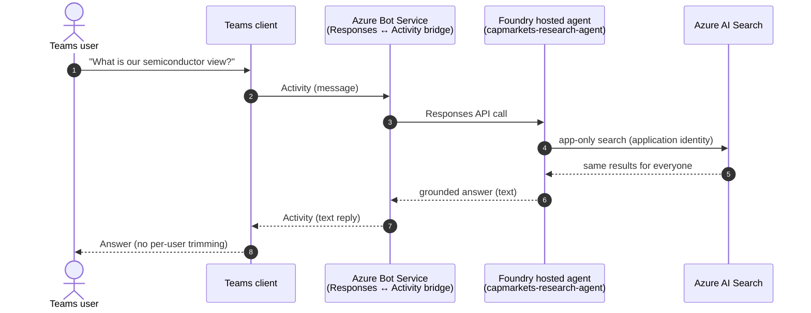
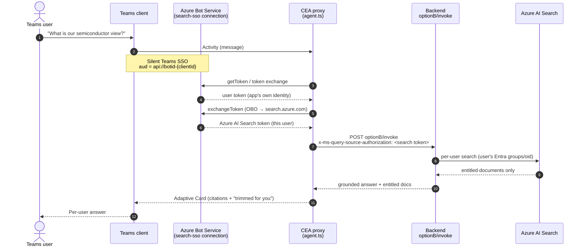
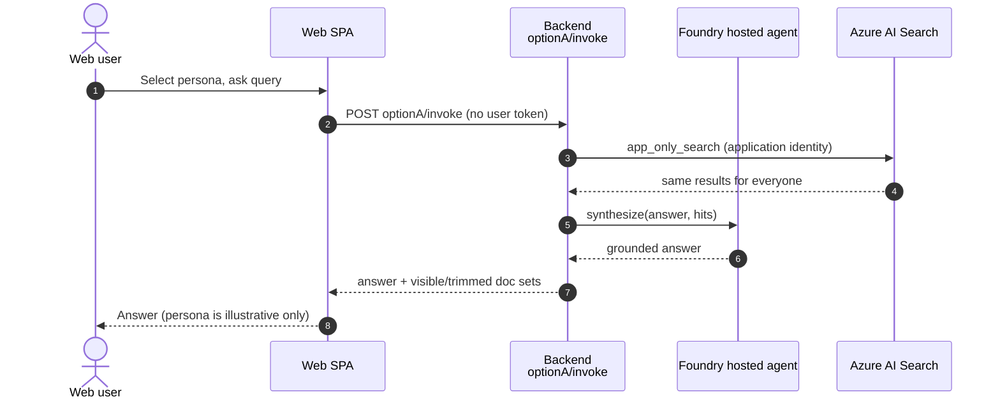
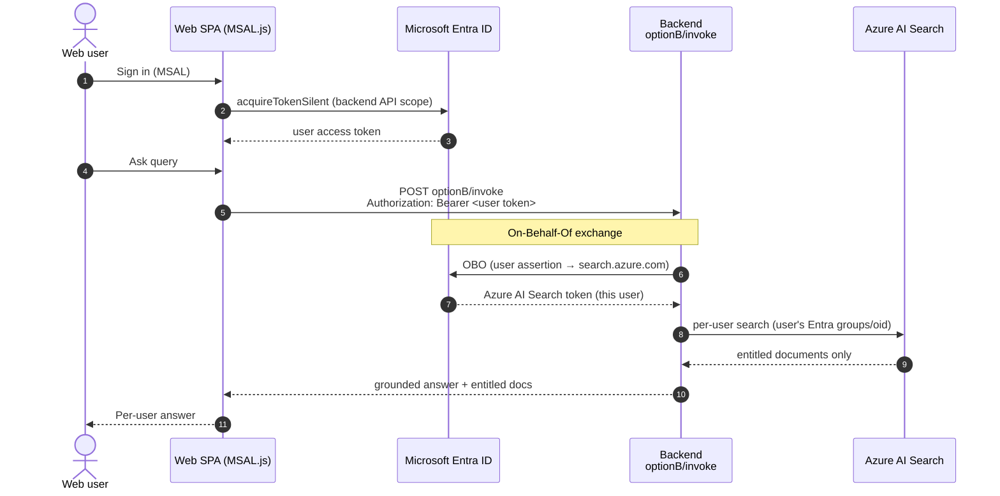
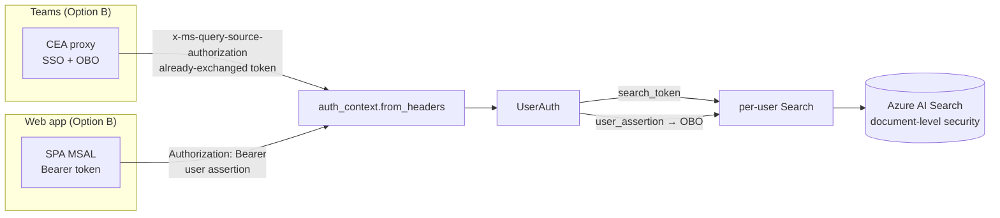

# End-to-end flows — Teams and Web app, Option A vs Option B

This document shows how a research query travels end-to-end across the two front doors
(**Microsoft Teams** and the **custom web app**) under the two entitlement models
(**Option A** app-only and **Option B** per-user On-Behalf-Of).

The design goal: **one deployed agent, two front doors**. Whether a request arrives from
Teams or the web app, it resolves to the same downstream Azure AI Search call — the only
difference is *whose* identity drives document trimming.

## The two options in one sentence

- **Option A — app-only.** The agent searches with a single application/admin identity.
  Every user sees the same result set. No per-user document trimming.
- **Option B — per-user (OBO).** The signed-in user's identity is exchanged
  On-Behalf-Of for an Azure AI Search token, so results are trimmed to that user's
  entitlements (document-level security).

## Matrix

| Surface | Option A (app-only) | Option B (per-user OBO) |
|---|---|---|
| **Teams** | Foundry hosted agent published directly via Azure Bot Service; in-container app-only Search | Custom Engine Agent proxy runs Teams SSO + OBO, calls backend with the user's Search token |
| **Web app** | SPA calls `optionA/invoke`; backend app-only Search | SPA (MSAL) sends user token; backend runs OBO, per-user Search |

## Components referenced

| Component | Path / resource |
|---|---|
| Teams proxy (Custom Engine Agent) | [proxy/src/agent.ts](../proxy/src/agent.ts) |
| Azure Bot + OAuth connection | `capmarkets-obo-bot` / `search-sso` |
| Backend invocation orchestration | [backend/app/services/invoke_service.py](../backend/app/services/invoke_service.py) |
| Per-request user identity | [backend/app/services/auth_context.py](../backend/app/services/auth_context.py) |
| OBO exchange (web path) | [backend/app/services/obo_service.py](../backend/app/services/obo_service.py) |
| Search (app-only + per-user) | [backend/app/services/search_service.py](../backend/app/services/search_service.py) |
| Answer synthesis (hosted agent) | [backend/app/services/foundry_service.py](../backend/app/services/foundry_service.py) |
| Web SPA + MSAL | [frontend/src/auth/msalConfig.ts](../frontend/src/auth/msalConfig.ts), [frontend/src/api/client.ts](../frontend/src/api/client.ts) |

Both front doors converge on `auth_context.from_headers(...)`, which produces a single
`UserAuth`:

- Web app (Option B) sends `Authorization: Bearer <user token>` → backend performs OBO.
- Teams (Option B) sends `x-ms-query-source-authorization: <already-exchanged Search token>`
  → backend uses it directly.

## 1. Teams client — Option A (app-only)

The Foundry hosted agent is published directly to Teams through Azure Bot Service. Teams
speaks the Activity protocol; Bot Service bridges Responses ↔ Activity automatically. The
agent's in-container Search runs with the **application** identity, so there is no per-user
trimming.

Notes:

- Identity basis: **application/admin** — every user gets the same documents.
- The Responses → Activity bridge preserves text; it does **not** carry citations,
  streaming, or Adaptive Cards.

## 2. Teams client — Option B (per-user OBO)

Teams routes to the **Custom Engine Agent proxy**, which is the OBO trust boundary. The
proxy runs Teams SSO silently, exchanges the SSO token On-Behalf-Of for an Azure AI Search
token, and forwards it to the backend so Search trims per user.

Notes:

- Identity basis: **the signed-in Teams user** — results reflect that user's entitlements.
- The proxy sends the **already-exchanged** Search token; the backend does no OBO on this
  path (it reads `x-ms-query-source-authorization`).
- If SSO/OBO is not yet complete, the proxy omits the token and the backend fails **closed**
  to public-only documents with a "sign in" hint.

## 3. Web app — Option A (app-only)

The SPA calls the app-only endpoint. The backend runs Search with the application/admin
identity and the hosted agent synthesizes the answer. No user token is required.

Notes:

- Identity basis: **application/admin**. The persona selector is illustrative; it does not
  change entitlements on this path.
- With `option_a_admin_identity` enabled, the answer is grounded on what the admin identity
  retrieved (so it reflects the full-access view rather than "no entitled research").

## 4. Web app — Option B (per-user OBO)

The SPA signs the user in with MSAL and sends the user token (issued for the backend's API
scope) as a Bearer header. The backend performs the On-Behalf-Of exchange itself, then runs
per-user Search.

Notes:

- Identity basis: **the signed-in web user** — same trimming semantics as Teams Option B.
- The backend, not the browser, holds the OBO credentials; the SPA only ever sends its own
  user token.
- `auth_context.from_headers(...)` puts the Bearer token into `user_assertion`, which
  triggers the OBO exchange in `obo_service`.

## Where the two front doors converge

Both Option B paths resolve to the identical per-user Search call, which is why a single
deployed agent serves both surfaces with correct per-user document trimming. Option A on
either surface skips identity entirely and uses the application identity.
